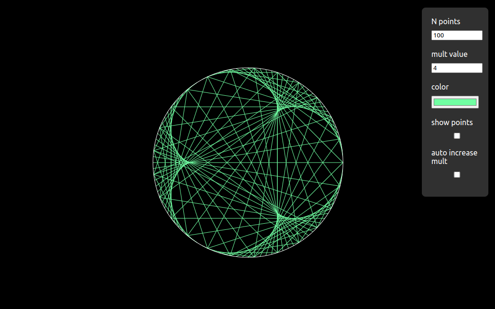

# Times table circle

Given $N$ points distributed equally on a circle perimeter, this program connects each point with the corresponding multiple of that point, if we provide that multiple

By default the multiple $M$ is $2$, so the point $0$ gets connected with $0$, the point $1$ with $2$, the $2$ with $4$ and so on  
If the target point is $> N$, then we take the modulo of the multiple  
If the target point is $102$, we use assume $2$ and connect it with $4$, if the target point is $103$, we assume $3$ and connect it with $6$...

The multiple can be modified, even with a partial value

Based on:

- [Times Tables, Mandelbrot and the Heart of Mathematics](https://www.youtube.com/watch?v=qhbuKbxJsk8) from [Mathologer](https://www.youtube.com/@Mathologer)
